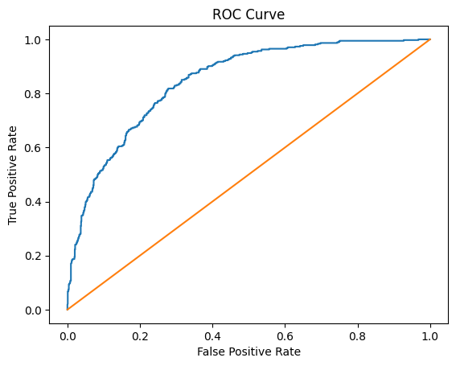
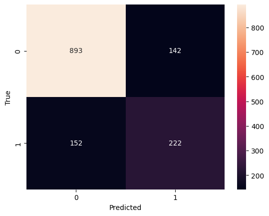
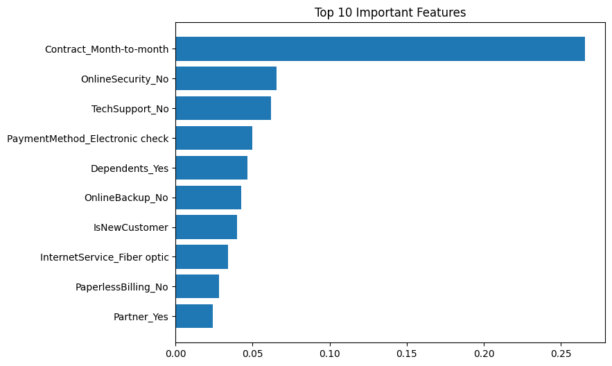

# Telecom Customer Churn Prediction

## 📊 Overview
This project aims to predict whether a customer will churn (leave the telecom company) or not using machine learning techniques.

---

## 📁 Dataset
The dataset includes customer information such as:
- Tenure
- Monthly Charges
- Contract Type
- Internet Services

---

## 🔍 Project Workflow
- Data Cleaning & Preprocessing
- Exploratory Data Analysis (EDA)
- Feature Engineering
- Handling Imbalanced Data using SMOTE
- Model Training & Hyperparameter Tuning

---

## 🤖 Models Used
- Logistic Regression
- Random Forest
- Gradient Boosting
- Support Vector Machine (SVM)
- K-Nearest Neighbors (KNN)
- XGBoost

---

## 📈 Results
- Achieved strong performance using multiple models
- Evaluated using Accuracy, F1-score, and ROC-AUC

---

## 📊 Visualizations

### ROC Curve

### Confusion Matrix

### Top Factors Affecting Churn

---

## 🚀 How to Run

1. Clone the repository:
git clone https://github.com/abdelrhman-hamada/Telecom-Customer-Churn-Prediction.git

2. Install dependencies:
pip install -r requirements.txt

3. Run the notebook:
jupyter notebook
